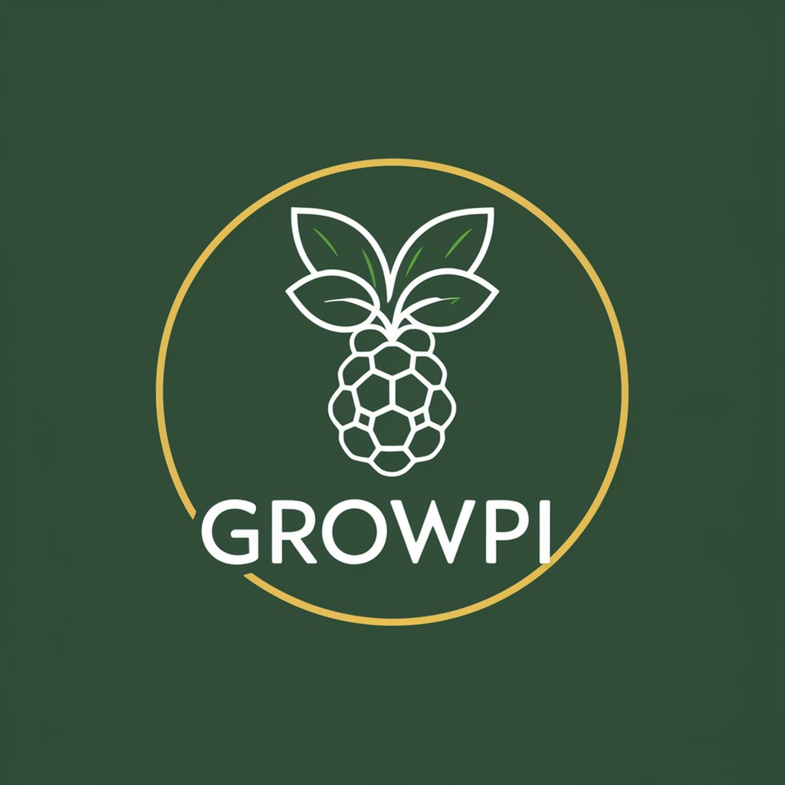

# growPi
Plant growing monitoring with raspberryPi.

### Roadmap
* Script for GIF based on a given timerange
* Using USB-Webcam as camera
* ...

### Hardware
Actually this can be run on any device where bash scripts can be executed. For this purpose it's prepared to
run on a Raspberry Pi hardware.

All required hardware can be bought here: https://www.berrybase.de/
You can also check out amazon or something else.

#### Main components
* **Raspberry Pi (Zero)**: https://www.raspberrypi.com/documentation/computers/raspberry-pi.html
  * For monitoring only a Raspberry Zero is adequate
  * If you want to connect more sensors (humidity, lux,..) a Raspberry Pi with GPIO pins is recommended
  * Suggestion: Raspberry Pi version > 3
  * Tested with 
    * Raspberry Pi 4 2GB
    * Raspberry Pi Zero
    * Raspberry Pi Zero W
    * Raspberry Pi Zero WH
  

* **Raspberry Pi Camera**: https://www.raspberrypi.com/documentation/accessories/camera.html
  * The script is optimized for camera v3 (NoIR also supported)
  * V2 camera should be also fine
  * Tested with
    * Camera V2
    * Camera V2 NoIR
    * Camera V3

#### More required components
* **Power Supply**
  * For newer hardware a regular USB-C cable + ac-adapter should work
  * Older hardware (like raspberry zero v1, RPi version < 4) requires Micro-USB
* **Camera-Cable**
  * _Notice_: when using a RPi Zero, you'll need a slim camera cable
* **MicroSD-Card**
  * Any MicroSD-Card should work, at least 16GB storage is recommended

#### Optional components
* **Case**: https://www.raspberrypi.com/products/case/
  * If you plan to use it outside a weatherproof case will be required
  * There a many different cases available out there, check if it fits on the version of your device before buying
  * Cases for camera are also available
* **Camera tripod**:
  * Sometimes it's hard to place the camera, a tripod could help

todo: add photos

### Installation
todo

### Configuration
todo
